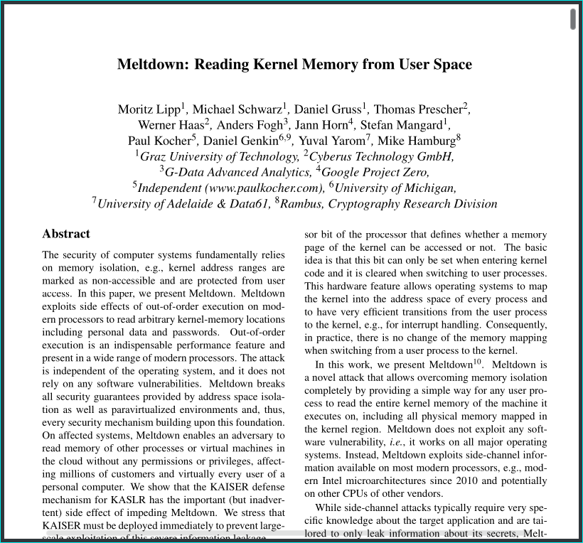

# Why?



The selling point of Evince for me is the previewing functionality.  You can
hover over any reference in a PDF and it will preview what is going on at the
referenced part.  I don't know any other PDF viewer that has that feature.
Porting this feature to Zathura would be the better way to go, but would require
some engineering.  This might be some project I will look into in the future but
for now I came to the conclusion that Evince is just the best for me.

So my goal with this repo is to make Evince behave more like Zathura.
That is why this repo contains patches for the following major changes to
upstream:

- The menu bar (or toolbar) can be hidden via a keyboard shortcut. This is
  `ALT-m` or F12 by default.
- Evince overwrites the pdf on hitting `CTRL+s`. By default, Evince always asks
  for a new filename.
- Some keyboard shortcuts are added/modified/removed. Examples are `J` and `K`
  for page up/down, or `CTRL+o` for going back in history.
- Scripts can be launched by keybindings.

Note that these are just the major patches. Check the [patches section](#patches) for a list
of all patches.

You can apply only a subset of the patches, just to your liking. And of course, you can modify the
code after applying any patches. Modifications to keyboard shortcuts can be done
in the file `shell/ev-application.c`.

You can expect me to update the patches when they are broken by upstream changes,
at least as long as no other PDF viewer has the above mentioned feature. I will tag
commits with the same tags used upstream to indicate that the patches work with the
tagged Evince version.

## Applying Patches

First you need to get the latest evince code. Then you need to clone this patches
repo. After that you can start applying any patches you would like to have
included in your build. Currently, they do not have to be applied in any specific
order. I suggest first applying all patches, and only after that changing stuff
in the code by hand.
For building instructions refer to the [building section](#building).
``` sh
git clone 'https://github.com/fabian-thomas/evince-patches'
cd evince-patches
git clone 'https://gitlab.gnome.org/GNOME/evince'
# -C 0 helps with conflicts between the patches.
git -C evince am -C 0 ../patches/add-keyboard-binding-to-toggle-menu-bar.patch
git -C evince am -C 0 ...
git -C evince am -C 0 ...
# patch the code further (e.g., modify keybindings)
# now build and install (see below)
```

Note: Make sure to apply `0-vim-like-bindings.patch` first, since it conflicts with some patches.
Note: You can also use the `apply.sh` script to apply all but the sync-pages patch.

## Building

You need to choose the correct prefix for your system. For most systems this
should be `/usr`. Note that these instructions only update the evince binary, so
this is based on the assumption that your libraries and other files of evince
should already be up to date. I'm not sure if this assumption breaks with
non-rolling-release distributions. If so check how you can install the compiled
files. I guess that should not be to hard.
```sh
meson setup --prefix /usr build
meson compile -C build
sudo cp build/shell/evince "$(which evince)"
```

## Patches

This section lists and describes all of the available patches.

### Toggle menu bar

`add-keyboard-binding-to-toggle-menu-bar.patch`

Adds `Alt+m` as keybinding for toggling the menu bar. Modify the binding to your
liking.

### Hide menu bar by default

`initially-hide-menu-bar.patch`

Hides the menu bar initially. If not used with the [toggle patch](#toggle-menu-bar),
basically disables the menu bar.

### Vim-like bindings

`0-vim-like-bindings.patch`

Adds vim-like keybindings. Modify to your liking.

Note: This patch should be applied first since others conflict with it.

### Add annotation right click

`add-annotation-right-click.patch`

Add an annotation from the right click menu.

### Save/Overwrite action + Overwrite pdf by default

`add-save-action-and-make-default.patch`

Add a save action to menus and use it as default on `CTRL+s`. By default, Evince always
asks for a new filename instead of overwriting the pdf.

### Launch scripts on keybinding

`custom-commands.patch`

This is my personal patch for launching scripts from Evince. You need to modify the patch or
the sources after applying the patch. I use this patch to open notes for the current PDF in my
text editor and to associate a PDF with a bibtex entry.

### Change current page from dbus

`sync-page.patch`

This patch is not actively used by me. It shows how to add a new dbus command. In that case,
how the active page in Evince can be changed with dbus. The repo also includes a `sync-page.sh`
script (in the `misc` dir) that shows how to execute the dbus action.
